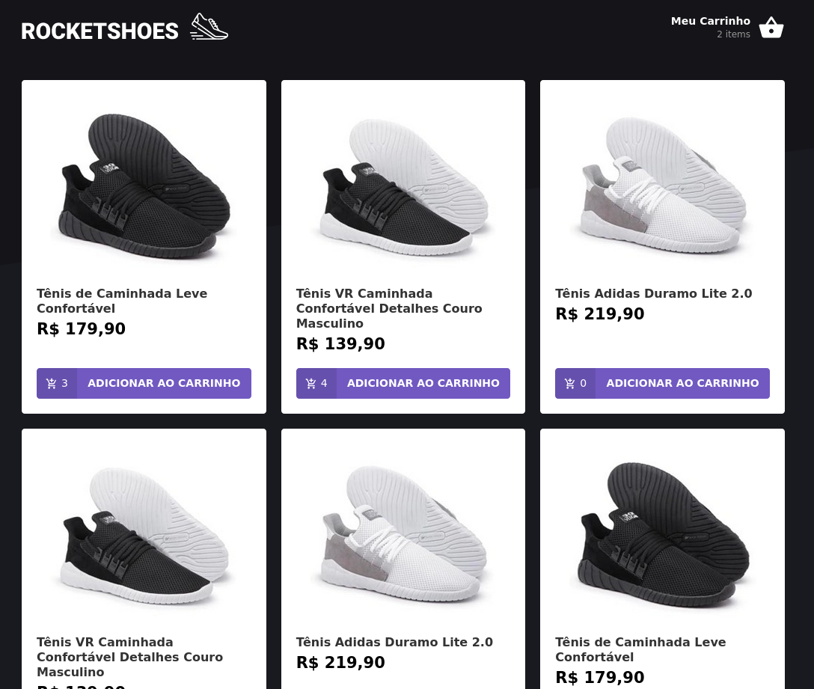

<h1 align="center">
  
</h1>

<h3 align="center">
  :rocket: [Bootcamp GoStack#10] Modulo 07
</h3>

## Descrição
Desenvolver um e-commerce em React para venda de Calçados.


### Resultado
<h1 align="center">
  
</h1>

### Subindo a aplicação
```sh
git clone ...
cd bootcamp-gostack-modulo-07
yarn
json-server server.json -p 3333 --watch # mock backend
yarn start
```
